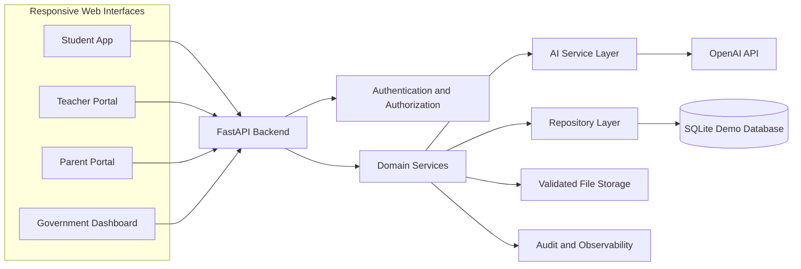
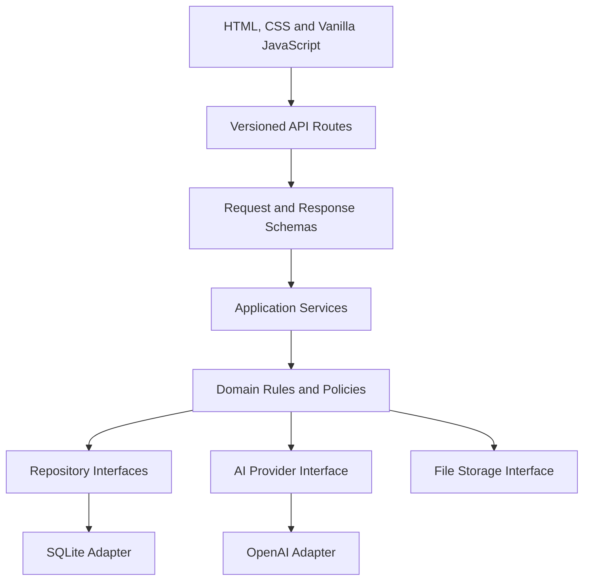
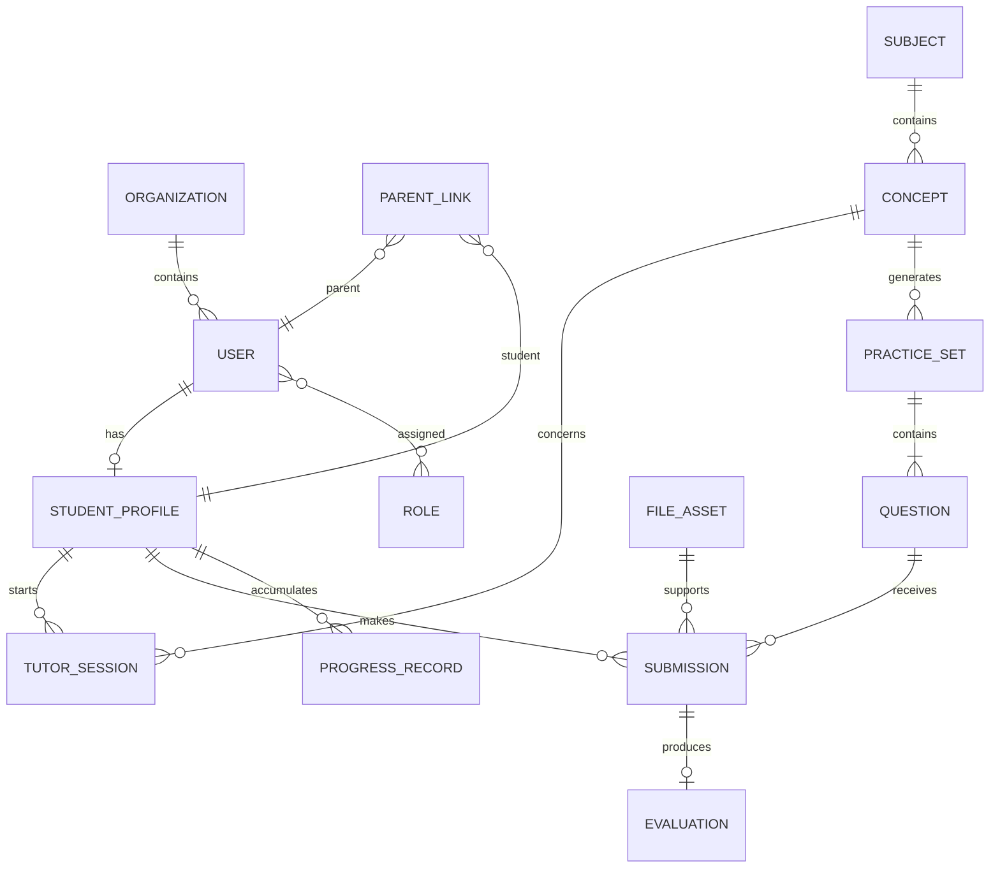
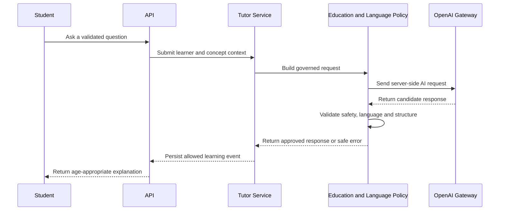
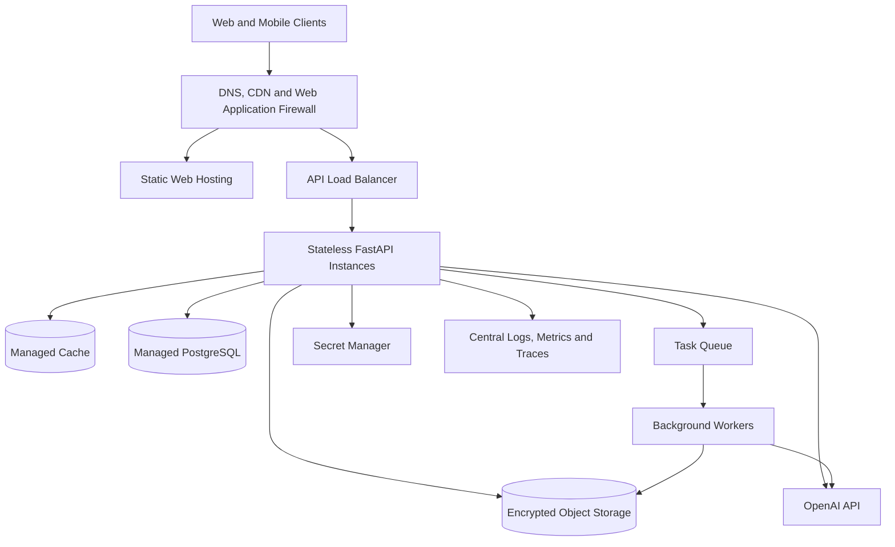

# Software Architecture

## Document purpose

This document defines the intended technical architecture for the Vedha AI Government Demo. It describes system boundaries and long-term direction; implementation details should be captured in focused design decisions when development begins.

## Project vision

Deliver a secure, polished, government-ready learning platform demonstration that enables Classes 1–12 students to learn independently at home while giving parents, teachers, school administrators, and government officials appropriate insight into learning outcomes.

## Architecture principles

- Separate presentation, application, domain, data-access, and external-service concerns.
- Keep all privileged operations, credentials, AI calls, and authorization decisions on the server.
- Design interfaces around stable contracts so the demo can evolve without a full rewrite.
- Treat English and Telugu, accessibility, privacy, observability, and failure handling as cross-cutting requirements.
- Begin with a modular monolith suited to a dependable demonstration, with explicit boundaries that can later be extracted into services.

## Overall architecture

The four responsive web interfaces communicate with one FastAPI backend. The backend owns authentication, authorization, domain workflows, AI orchestration, persistence, uploads, and audit events. SQLite supports the controlled demo; repositories isolate database access so a managed relational database can replace it later.



## Interface responsibilities

### Student App

Provides the independent-learning journey: profile context, class/subject/concept selection, English or Telugu learning, AI tutoring, multimodal explanations, follow-up questions, practice, answer submission and evaluation, uploads, and progress. It must teach before testing and guide students through mistakes rather than merely reveal answers.

### Teacher Portal

Provides authorized class and student views, concept-level performance, intervention signals, assignment or practice oversight, and learning-support workflows. Teachers see only students and groups within their permitted scope.

### Parent Portal

Provides a clear view of linked children, progress, strengths, areas needing attention, recent activity, and age-appropriate recommendations. Parent access is restricted to explicitly linked student records.

### Government Dashboard

Provides aggregated, privacy-preserving indicators across permitted organizational scopes such as schools, classes, subjects, and concepts. It must avoid exposing unnecessary student-level data and clearly identify demo or synthetic data.

## Backend

The Python/FastAPI backend is a modular monolith with versioned HTTP APIs. Route handlers validate transport data and delegate to application services. Domain services enforce workflows and authorization. Repository and provider interfaces isolate SQLite, file storage, and OpenAI-specific behavior.

## Layered design



### API layers

1. **Transport layer:** routing, content negotiation, request limits, and standardized errors.
2. **Schema layer:** input validation and explicit response contracts.
3. **Application layer:** use-case orchestration and transaction boundaries.
4. **Domain layer:** educational, practice, identity, access, and progress rules.
5. **Infrastructure layer:** persistence, file storage, AI provider, logging, and configuration adapters.

APIs should use a versioned prefix such as `/api/v1`, stable resource naming, correlation IDs, pagination where needed, and a consistent error envelope. Idempotency should be considered for submissions and upload finalization.

### Database layers

- Domain entities describe users, roles, organizations, student profiles, curriculum, tutor sessions, practice sets, responses, evaluations, progress, file metadata, and audit events.
- Repository interfaces express domain-focused reads and writes.
- SQLite adapters implement repositories for the demo.
- A migration mechanism must track schema evolution once backend development starts.
- Service methods own transaction boundaries; route handlers must not issue SQL.

Conceptual relationships:



The final schema must be validated during backend design; this diagram communicates boundaries rather than physical table definitions.

## Multi-board curriculum and metadata-first RAG foundation

Curriculum is an application-owned domain independent of the AI provider. The
hierarchy is `Board -> Academic Year -> Class -> Subject -> Medium`, followed by
books, chapters, topics, subtopics, pages, and immutable chunks. Andhra Pradesh
State Board, Telangana State Board, CBSE, and ICSE are initial configured
boards; additional canonical board IDs and catalog data can be added without
changing resolver logic.

The deterministic curriculum resolver validates each hierarchy level in order
and returns a canonical selection containing board, academic year, class,
subject, medium, and language. Routes and future retrieval services must use
that selection rather than accepting AI-generated curriculum metadata.

Each chunk carries portable metadata for its curriculum location, language,
version, and timestamps. Schema fields are reserved for embeddings, images,
diagrams, animations, voice, learning objectives, and Bloom level, but Sprint
4B performs no embedding generation, vector search, PDF processing, multimedia
processing, or provider retrieval.

The future retrieval pipeline boundary is:

```text
validated curriculum selection
    -> authorized curriculum repository query
    -> metadata filters
    -> future indexed retrieval/ranking
    -> governed lesson context assembly
    -> AI provider
```

Metadata filtering must precede future semantic retrieval so content cannot
cross board, academic-year, class, subject, or medium boundaries. Multimedia
references remain opaque metadata identifiers until separately approved asset
storage, authorization, validation, and accessibility designs exist.

## AI services

The AI layer is server-side and provider-abstracted. Its responsibilities include tutor response orchestration, bilingual prompt policy, age/class context, practice generation, answer evaluation, safety controls, structured-output validation, retry/timeout policy, and usage telemetry.

### AI layers

1. **Use-case services:** tutoring, explanation, practice generation, and answer evaluation.
2. **Educational policy:** teach-first behavior, age appropriateness, mistake identification, corrective guidance, and performance adaptation.
3. **Language policy:** English/Telugu selection and response-language validation.
4. **Prompt assembly:** combines trusted instructions and validated learner context; user content remains untrusted data.
5. **Provider gateway:** OpenAI request/response handling, timeouts, retries, and error translation.
6. **Output validation:** schema, language, safety, and practice-composition checks, including exactly 5 Easy, 5 Medium, and 5 Hard questions.
7. **Observability:** latency, failures, token usage, request identifiers, and policy-validation results without logging secrets or unnecessary personal data.



## Authentication and authorization

- Use secure, server-managed authentication with short-lived sessions or tokens and an explicit renewal/revocation strategy.
- Apply role-based access control for student, parent, teacher, school administrator, and government roles.
- Add relationship- and scope-based checks: parent-to-child links, teacher-to-class assignments, and government organizational scope.
- Enforce authorization in application/domain services, not only in the UI.
- Store passwords only through a modern password-hashing algorithm if local credentials are used.
- Protect login and sensitive endpoints with throttling, generic authentication errors, and audit events.
- Require stronger authentication for administrative and government roles in a production evolution.

## Database

SQLite is appropriate for a controlled, single-instance demonstration. Enable foreign keys, constrain domain values, index common access paths, use transactions, and keep migration history. Seeded demonstration data must be synthetic and clearly distinguishable from real learner data. The repository abstraction must support future migration to PostgreSQL without changing domain behavior.

## File storage

Uploads flow through a server-side validation pipeline:

1. Enforce authenticated ownership and authorization.
2. Apply size, count, extension, and detected-content-type allowlists.
3. Generate server-controlled opaque names; never trust client paths.
4. Scan files for malicious content when the target environment supports it.
5. Store files outside public/static application paths.
6. Record metadata, ownership, integrity hash, and lifecycle state in the database.
7. Serve files only through authorized download endpoints or short-lived signed URLs in cloud environments.

Local private storage may support the demo. Future deployments should use encrypted object storage with retention and deletion policies.

## Security

- Keep all secrets in environment variables or a managed secret store; never expose the OpenAI key to browser code.
- Validate and normalize every input at trust boundaries and encode output for its destination.
- Apply least privilege and deny access by default.
- Use TLS in hosted environments, secure headers, restrictive CORS, CSRF protection where cookie authentication applies, and safe cookie settings.
- Parameterize all database access through repositories or an approved data layer.
- Defend AI workflows against prompt injection, unsafe output, excessive usage, and untrusted file content.
- Maintain privacy-aware audit trails for privileged access and significant learning actions.
- Avoid storing raw AI prompts/responses or personal data unless necessary and governed by retention policy.
- Back up persistent data and test restoration before any production evolution.
- Perform threat modeling and privacy review before using real student data.

## Technology stack

| Concern | Foundation choice | Evolution path |
|---|---|---|
| Web UI | HTML5, CSS3, vanilla JavaScript | Shared design system; framework only through an approved decision |
| Backend | Python, FastAPI | Horizontally scaled API instances |
| Database | SQLite | Managed PostgreSQL |
| AI | OpenAI API through a server gateway | Multi-model/provider routing if justified |
| File storage | Private local demo storage | Encrypted cloud object storage |
| Testing | pytest plus browser/UI tests | CI quality gates and broader automated suites |
| Version control | Git and GitHub | Protected branches and automated delivery workflows |

## Planned folder structure

The following is a target structure, not an instruction to create folders before their implementation phase:

```text
Vedha-AI-Government-Demo/
├── AGENTS.md
├── README.md
├── docs/
│   ├── ARCHITECTURE.md
│   ├── PROJECT_MANAGER.md
│   ├── ROADMAP.md
│   ├── TASKS.md
│   └── VEDHA_AI_MASTER_RULES.md
├── frontend/
│   ├── student/
│   ├── teacher/
│   ├── parent/
│   ├── government/
│   └── shared/
├── backend/
│   ├── app/
│   │   ├── api/
│   │   ├── core/
│   │   ├── domain/
│   │   ├── services/
│   │   ├── repositories/
│   │   └── integrations/
│   └── tests/
├── storage/          # Local-only runtime data; excluded from version control
└── scripts/          # Approved development and operational utilities
```

## Future cloud architecture



The future topology adds stateless scaling, managed persistence, asynchronous processing for expensive evaluations/uploads, centralized observability, backups, and controlled network boundaries. Provider and region selection must follow government, privacy, and data-residency requirements.

## Future mobile app

A future native or cross-platform mobile app should consume the same versioned APIs rather than duplicate business logic. Mobile readiness requires stable authentication flows, bandwidth-aware payloads, accessible media, resumable uploads, push-notification consent, and a deliberately designed offline-learning/synchronization model.

## Scalability considerations

- Keep API instances stateless and move sessions to an appropriate shared mechanism when scaling.
- Use pagination, indexes, aggregate tables or materialized views for dashboard workloads.
- Queue long-running AI, file-processing, and report-generation tasks.
- Apply per-user and per-organization quotas to AI and upload operations.
- Cache stable curriculum metadata while preserving authorization boundaries.
- Separate read-heavy analytics workloads from transactional traffic when volume warrants it.
- Use connection pooling, managed backups, and tested migrations after moving beyond SQLite.
- Measure before extracting services; preserve modular boundaries meanwhile.

## Non-functional requirements

| Category | Requirement |
|---|---|
| Availability | Demo-critical journeys degrade gracefully and present actionable recovery messages. |
| Performance | Establish measured budgets before implementation; interactive non-AI requests should feel immediate, while AI operations expose progress and bounded timeouts. |
| Accessibility | Target WCAG 2.1 AA practices, keyboard operation, visible focus, sufficient contrast, semantic markup, and usable text scaling. |
| Localization | English and Telugu content, fonts, layout, and fallback behavior are tested as first-class paths. |
| Security and privacy | Least privilege, input and upload validation, server-side secrets, auditability, and data minimization are mandatory. |
| Reliability | Transactions protect multi-step writes; retries are bounded and used only where safe. |
| Maintainability | Clear modules, typed contracts, documentation, migrations, tests, and low duplication are required. |
| Observability | Structured logs, metrics, traces/correlation IDs, and health endpoints support diagnosis without leaking sensitive data. |
| Compatibility | Responsive interfaces support current major desktop and mobile browsers selected in the test plan. |
| Testability | External providers are replaceable with test doubles; critical workflows have automated backend and UI coverage. |

## Architectural governance

Material changes to security, data ownership, service boundaries, or the technology stack require a recorded decision in `PROJECT_MANAGER.md` and explicit human approval where mandated by the project rules. Architecture should be reviewed at every milestone boundary.
