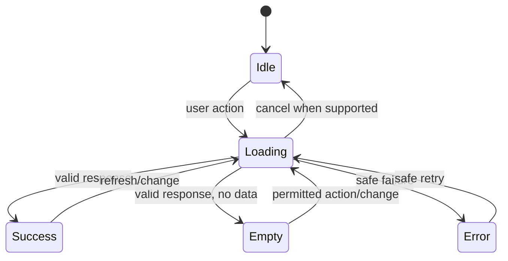

# Component Library Specification

## Purpose and architecture reference

This document defines a reusable, framework-free component system for the HTML/CSS/vanilla JavaScript clients in `ARCHITECTURE.md`. It specifies semantics and behavior, not application code. Visual tokens and accessibility rules come from `UI_GUIDELINES.md`; screens and features compose these components without embedding domain authorization.

## Component principles

- Prefer semantic HTML and progressive enhancement before custom JavaScript behavior.
- Separate structure, presentation, and behavior into complete HTML, CSS, and JavaScript files when implementation begins.
- Reuse shared primitives across experiences while applying role-specific composition and tone.
- Components accept localized content and flexible length; they do not concatenate translation fragments.
- Every interactive component has keyboard, focus, disabled, loading, error, reduced-motion, and cleanup behavior where applicable.
- Components render data already authorized by the backend; hiding a control is never an access control.

## Token foundation

| Token group | Required semantic tokens |
|---|---|
| Color | background, surface, text, muted text, border, primary, focus, success, warning, error, information, chart series/suppression |
| Spacing | 4, 8, 12, 16, 24, 32, 48, 64px scale |
| Typography | body, supporting, label, heading levels, numeric/tabular, Telugu-capable font/line-height |
| Shape | small/medium radius, border width, focus-ring width |
| Elevation | base, raised, overlay; used sparingly |
| Motion | immediate, fast, normal; reduced-motion alternatives |
| Layout | content widths, gutters, navigation widths, responsive breakpoints |

Tokens are semantic CSS custom properties; components must not rely on scattered literal colors/spacing. Light mode is required. Dark tokens remain optional until approved.

## Primitive components

| ID | Component | Purpose | Required states/behavior |
|---|---|---|---|
| C-001 | Button | Trigger an action | Primary/secondary/tertiary/destructive; focus, hover, active, disabled, loading; 44×44 target |
| C-002 | Link | Navigate | Descriptive text; visited policy; visible focus; external indicator when applicable |
| C-003 | Icon | Supplement meaning | Decorative icons hidden; meaningful icons named; never sole carrier of status |
| C-004 | Badge/Status | Communicate compact state | Text + semantic color/icon; no ambiguous color-only state |
| C-005 | Divider | Separate related regions | Semantic grouping preferred; decorative line hidden from assistive tech |
| C-006 | Avatar/Identity | Identify current synthetic actor/child | Text fallback; no sensitive tooltip; clear selected identity |

## Form components

| ID | Component | Required contract |
|---|---|
| C-101 | Text input / textarea | Persistent label, hint, required marker, limits, error association, autocomplete/input mode, safe retained value |
| C-102 | Select | Visible label, clear option, disabled/loading behavior, keyboard-native behavior preferred |
| C-103 | Radio group | Fieldset/legend, single selection, clear focus/error |
| C-104 | Checkbox | Independent boolean with positive label and adequate target |
| C-105 | Language switcher | “English” and “తెలుగు” names, current state announced, no flag icons, no permission change |
| C-106 | File upload | Allowed types/limits before choice, selected-file list, remove/retry, validation/progress, no path trust |
| C-107 | Form error summary | Links/focuses invalid fields and announces count/safe summary |
| C-108 | Filter group | Applied/pending state, clear/reset, mobile disclosure, result update announcement |

## Navigation and layout components

| ID | Component | Required contract |
|---|---|
| C-201 | App shell | Skip link, header, primary navigation, main landmark, status region, session actions |
| C-202 | Primary navigation | Current-page state, keyboard/mobile operation, role-specific destinations |
| C-203 | Breadcrumb | Hierarchical administrative context only; current item not linked |
| C-204 | Page header | One page title, context/subtitle, optional scoped actions |
| C-205 | Section | Semantic heading relationship and consistent vertical rhythm |
| C-206 | Responsive grid/stack | Content-driven layout that preserves reading/focus order |
| C-207 | Tabs | Only same-context views; proper tab semantics/keyboard behavior; deep-link policy |
| C-208 | Pagination | API-backed bounded navigation, current position, accessible labels |

## Feedback and overlay components

| ID | Component | Required contract |
|---|---|
| C-301 | Inline validation | Specific, non-blaming, associated with input; not color-only |
| C-302 | Alert/banner | Semantic severity, concise action, controlled dismissal, safe reference ID |
| C-303 | Toast | Noncritical confirmation only; announced, persistent enough, not sole record of failure |
| C-304 | Loading indicator/skeleton | Honest progress, stable layout, accessible status, reduced motion |
| C-305 | Empty state | Distinguishes no-data/filter/permission/unavailable and gives permitted next step |
| C-306 | Modal dialog | Exceptional focused decision; trapped/restored focus, Escape policy, labeled purpose |
| C-307 | Confirmation dialog | Consequence-first wording; explicit destructive action; cannot authorize server action |
| C-308 | Progress indicator | Determinate when known; current step/value announced; no fabricated percent |

## Data and visualization components

| ID | Component | Required contract |
|---|---|
| C-401 | Card | Related content only, consistent heading/action order, interactive semantics when clickable |
| C-402 | Metric card | Metric name/value/unit, period, context, freshness, definition link, suppression state |
| C-403 | Data table | Caption, scoped headers, sorting/filter state, units, pagination, responsive strategy |
| C-404 | Chart frame | Title, description, legend, source/period, text/table alternative, non-color encoding |
| C-405 | Trend | Direction plus magnitude/context; avoids good/bad meaning without policy |
| C-406 | Privacy-suppressed value | Explains suppression without revealing or enabling reconstruction |
| C-407 | Definition drawer | Metric calculation, source, freshness, missing-data, and privacy details |

## Learning components

| ID | Component | Required contract |
|---|---|
| C-501 | Curriculum selector | Class → subject → concept dependency, clear current context, safe empty/error states |
| C-502 | Tutor message | Distinguish student/tutor/system, localized content, safe rendering, timestamp/context policy |
| C-503 | Tutor composer | Question input, limits, submit/loading, duplicate prevention, safety guidance |
| C-504 | Explanation mode selector | Text always available; voice/visual availability and accessible fallback clear |
| C-505 | Practice question | Difficulty label, prompt/media alternative, answer control, position without premature solution |
| C-506 | Practice navigator | 15-question progress, answered/unanswered state, keyboard operation, no forced data loss |
| C-507 | Answer uploader | Composes C-106 with question ownership and processing state |
| C-508 | Evaluation feedback | Mistake, reason, corrective steps, next action; not final-answer-only |
| C-509 | Learning progress | Personal subject/concept context with accessible visual/text representation |

## Experience compositions

### Student App

Uses App shell, curriculum selector, tutor components, practice components, answer uploader, evaluation feedback, and personal progress. Density and language remain age appropriate.

### Parent Portal

Uses linked-child identity selector, metric cards, trends, activity list, empty state, and support-guidance cards. It excludes raw unrestricted tutor content.

### Teacher Portal

Uses assigned-scope filters, tables, charts, definition drawer, student/concept insight panels, and intervention guidance. It maintains evidence and avoids score-only labeling.

### Government Dashboard

Uses organization/period filters, metric cards, accessible charts/tables, privacy-suppressed values, data-context banner, and definition drawer. Every analytic component carries scope, period, freshness, and synthetic-demo context.

## Component state model

Authorization denial is not a generic empty state. Components receive a safe permission outcome and render the approved access/not-found treatment without protected details.

## Localization contract

Component APIs use message keys or complete localized strings, never assembled sentence fragments. Layout supports 30–50% expansion, Telugu glyph shaping/line height, mixed technical terms, wrapping, and locale-appropriate accessible labels. Dates/numbers/units use an approved formatting layer while stored API values remain locale-neutral.

## Accessibility contract

Each component specification and test story includes semantic role/element, accessible name/description, keyboard interaction, focus entry/exit/restoration, status announcements, contrast, zoom/reflow, reduced motion, touch target, screen-reader behavior, and Telugu content. Custom widgets require documented keyboard behavior and justification over native elements.

## Component documentation template

When implementation begins, every reusable component records: purpose, anatomy, variants, inputs/events, content rules, states, responsive behavior, localization, accessibility, security/privacy considerations, examples for all four applicable experiences, and automated/manual tests.

## Component acceptance criteria

- No component embeds role authorization, secrets, provider credentials, or direct database behavior.
- Shared components render all required English/Telugu and responsive states without clipping or action loss.
- Interactive components are fully keyboard operable with visible focus and correct announcements.
- Error/loading/empty/disabled behavior is explicit and tested.
- Experience-specific compositions reuse primitives without collapsing the four information boundaries.
- Component changes are regression-tested across every consuming screen.
