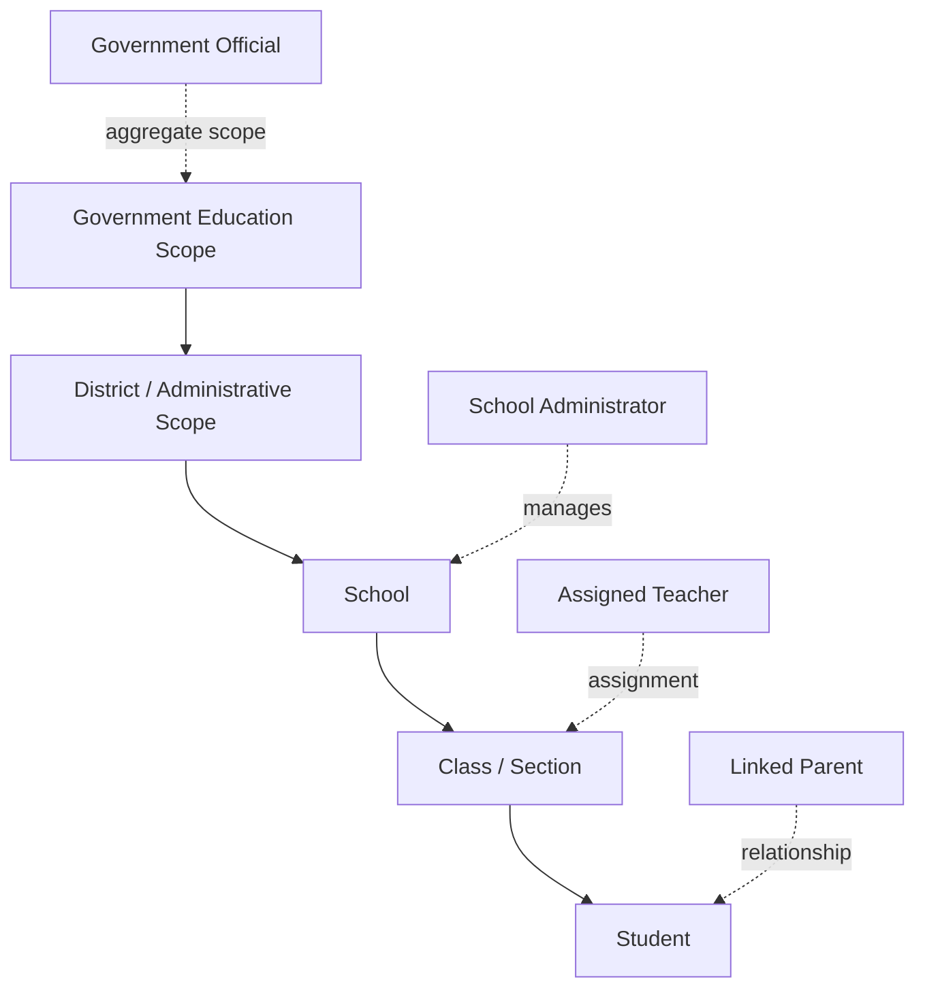
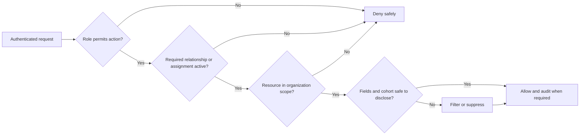

# Organization and Access Model

## Purpose and architecture reference

This document defines the Government Demo’s organizational hierarchy, actor relationships, and information boundaries. It refines the identity and authorization concepts in `ARCHITECTURE.md`; enforcement remains server-side under `API_STANDARDS.md`, `DATABASE_STANDARDS.md`, and `SECURITY_STANDARDS.md`.

## Demo organization model

The demo models a bounded education hierarchy sufficient to show credible role scopes without claiming full statewide administration.

District is an optional demonstration grouping. Its inclusion does not require a comprehensive government master-data system. Every organization and relationship uses opaque identifiers, active lifecycle state, and synthetic labels/data.

## Actor model

| Actor | Experience | Scope source | Key permissions | Prohibited access |
|---|---|---|---|---|
| Student | Student App | Own authenticated profile | Learn, practise, submit, upload, view own feedback/progress | Other students or adult dashboards |
| Parent | Parent Portal | Active parent–student link | View approved progress/activity and recommendations for linked children | Unlinked learners, teacher notes outside policy, class/government views |
| Teacher | Teacher Portal | Active teacher–class/subject assignment | View assigned learners/classes, concepts, evidence, and intervention signals | Unassigned classes/students or government-wide analytics |
| School administrator | Teacher/administrative scope as approved | Active school responsibility | School-scoped operational/aggregate views and assignment administration when specified | Other schools or unrestricted learner disclosure |
| Government official | Government Dashboard | Explicit organization hierarchy scope | View approved aggregate indicators and permitted drill-down | Unrestricted student records, unsuppressed small cohorts, unrelated scopes |

## Relationships and lifecycle

### Parent–student link

A link is explicit, auditable, time-bound or revocable, and independent for each child. Identity alone never infers parenthood. Removing a link ends future access immediately while preserving governed audit history.

### Teacher assignment

Assignments identify teacher, school, class/section, optional subject, effective period, and active state. Authorization evaluates the current assignment on every protected request; previously cached UI data cannot preserve access.

### Government scope

Government users receive an allowlisted root scope and approved descendant visibility. Drill-down obeys metric and cohort-suppression policy at every level. Higher hierarchy position does not automatically grant student-level access.

### Multi-role users

If one identity has multiple roles, the active experience/scope must be explicit. Switching experience changes presentation context but never expands the permissions granted by the server. Audit records include the effective role/scope.

## Authorization decision model

All conditions are evaluated in application/domain services with repository queries constrained by scope. The frontend may explain permission state but does not decide access.

## Demo data organization

The initial synthetic dataset should provide enough variation to demonstrate filters and role boundaries:

- One government scope with at least two administrative groups
- Multiple synthetic schools
- Multiple classes/sections and subjects
- Students with varied, non-stigmatizing synthetic learning activity
- Parent links, teacher assignments, and government scopes with positive and negative authorization examples
- Clearly labeled demo accounts and data periods

Exact volumes must be chosen with SQLite performance rehearsal and privacy-threshold behavior in mind.

## Separation of experiences

- Each experience has its own navigation and landing page defined in `SCREEN_FLOW.md`.
- Cross-experience deep links require authentication and an authorized effective role.
- Student educational content is not repurposed as parent/teacher/government disclosure without an explicit field policy.
- Parent and teacher views provide context and guidance rather than exposing unrestricted raw AI conversations.
- Government views use defined aggregates; a metric cannot be introduced solely as a chart label without a source and calculation specification.

## Organizational administration boundary

The Government Demo may use pre-seeded organizations, accounts, links, and assignments. Interactive statewide onboarding, identity proofing, bulk rostering, and complex transfer workflows are outside current scope unless separately specified and approved. Any demo administration screen must be explicitly included in `FEATURE_SPECIFICATIONS.md` before implementation.

## Audit expectations

Audit significant identity, link/assignment change, privileged view, denied access anomaly, export (if later approved), and administrative action. Records use minimized actor/action/target/scope/result/correlation data and never include secrets or unrestricted student/AI content.

## Acceptance criteria

- Every protected feature maps to an actor and scope source in this document.
- Parent, teacher, administrator, and government access can be revoked without deleting identity history.
- Negative tests prove cross-user, unlinked-child, unassigned-class, cross-school, and out-of-government-scope denial.
- Government aggregates enforce the approved cohort/privacy rules at each filter level.
- English and Telugu experiences expose the same permitted actions and data, with no authorization difference caused by language.
- Organization/relationship rules remain compatible with the layered architecture and future PostgreSQL migration.
