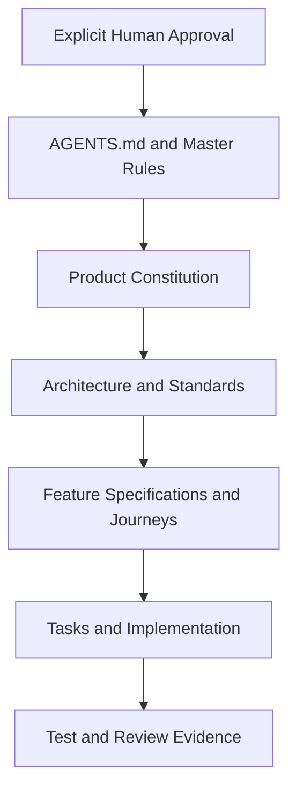

# Product Constitution

## Purpose and authority

This constitution defines durable product decisions for the Vedha AI Government Demo. It is subordinate to `AGENTS.md` and `VEDHA_AI_MASTER_RULES.md` and must be interpreted with `ARCHITECTURE.md`, the delivery standards, and approved human decisions. It clarifies product boundaries; it does not replace feature specifications or technical standards.

## Mission

Demonstrate a credible, secure, bilingual learning platform in which Classes 1–12 students can learn independently at home, while authorized parents, teachers, school leaders, and government officials receive appropriate and privacy-conscious insight.

## Government Demo promise

The demo must feel complete and professionally engineered in every presented journey. It will use realistic synthetic data, truthful system states, consistent metric definitions, and safe failure behavior. It must never imply that unimplemented, unvalidated, or production-only capabilities are operational.

## Constitutional principles

1. **Independent learning first.** Student flows teach before testing, use understandable examples, explain mistakes, and provide corrective guidance.
2. **Bilingual by design.** English and Telugu are first-class journeys, not post-build translations. Telugu selections produce primarily Telugu responses.
3. **Role separation.** Student, Parent, Teacher, and Government experiences have separate navigation, permissions, data scopes, and presentation priorities.
4. **Privacy before insight.** Student-level information is disclosed only to an authorized learner, linked parent, or assigned educator. Government views prefer privacy-preserving aggregates.
5. **Server authority.** Authentication, authorization, AI access, domain rules, validation, file security, and secrets remain behind the FastAPI boundary described in `ARCHITECTURE.md`.
6. **Evidence over appearance.** Metrics, progress, and AI feedback must be traceable to governed data and policies; the UI never invents information to fill a screen.
7. **Accessible professionalism.** Responsive, keyboard-usable, readable, low-clutter interfaces follow `UI_GUIDELINES.md` and target WCAG 2.1 AA practices.
8. **Safe evolution.** The modular monolith, versioned APIs, repositories, and provider gateways permit future cloud/mobile evolution without premature service complexity.
9. **Quality is continuous.** Security, tests, bilingual review, observability, documentation, and error handling are part of each feature rather than a final cleanup phase.
10. **Human authority is preserved.** Required approvals cannot be bypassed by an AI role, deadline, demonstration need, or technical convenience.

## Experience boundaries

| Experience | Primary purpose | Permitted information | Explicit boundary |
|---|---|---|---|
| Student App | Learn, practise, submit answers, receive guidance, and understand progress | The authenticated student’s profile, learning context, work, feedback, and progress | No access to another learner’s records or adult/government controls |
| Parent Portal | Understand and support a linked child | Progress, activity, strengths, attention areas, and guidance for explicitly linked children | No unlinked child, class-wide, or government data |
| Teacher Portal | Support assigned learners and classes | Authorized class/student learning evidence and concept-level intervention signals | No students/classes outside current assignment scope |
| Government Dashboard | Understand system-level outcomes and adoption | Approved organization-scoped, privacy-preserving aggregates | No unrestricted student-level access or reconstructable small cohorts |

## Educational integrity

- AI explanations must be appropriate to the selected class and current concept.
- Testing follows concept teaching; feedback identifies the learner’s mistake and next corrective step.
- Practice sets contain exactly 15 questions: 5 Easy, 5 Medium, and 5 Hard.
- Performance adaptation changes explanation and practice support without stigmatizing the learner.
- AI output remains advisory and must pass structural, language, educational, and safety validation.
- Voice and visual explanations must have usable textual alternatives before being treated as demo-complete.

## Language constitution

Language choice applies to navigation, forms, validation, loading/error states, tutor output, practice, feedback, dashboards, and help content. Technical or mathematical terminology may remain in English when it improves comprehension, but a Telugu-selected request must not return an entirely English journey. The active language persists safely across screens and does not alter authorization or stored domain meaning.

## Data and trust constitution

- The Government Demo uses clearly labeled synthetic data unless separate privacy, legal, and human approval permits otherwise.
- Collect and retain only data required for an approved journey.
- Uploaded images/PDFs and AI provider output are untrusted until validated.
- Browser state is never evidence of identity, ownership, permission, assessment completion, or progress.
- Metrics disclose source context, time period, freshness, definition, and privacy suppression where applicable.
- Secrets and unrestricted personal/AI content are excluded from client assets, logs, documentation, fixtures, and screenshots.

## Government Demo scope

### In scope

- Responsive shells and critical journeys for all four experiences
- Secure authentication and role/relationship/organization authorization
- Student profile and class/subject/concept selection
- Bilingual AI Tutor with text, follow-up, and governed voice/visual pathways
- Exact-composition practice, submissions, validated image/PDF uploads, evaluation, and progress
- Parent-linked progress, teacher-assigned performance, and government aggregate insights
- Synthetic demo data, testing, observability, accessibility, and controlled deployment readiness

### Outside current scope unless approved

- Production deployment or real student data
- Native mobile applications, offline synchronization, public self-registration, payments, social features, open messaging, or unrestricted exports
- A full school information system, learning-management replacement, statewide production analytics platform, or autonomous high-stakes grading
- New frameworks, providers, cloud services, or microservice extraction without an approved architectural decision

## Product decision hierarchy

When documents conflict, stop and escalate. Do not quietly reinterpret higher-authority rules. Accepted changes must update the smallest authoritative document and all directly affected downstream specifications.

## Change control

A proposed constitutional change must state the problem, affected users, alternatives, security/privacy/educational consequences, architectural impact, migration/rollback needs, and required human approver. Changes affecting major folders, architecture, production, secrets, destructive data behavior, or real student data follow the explicit approval boundaries in the project rules.

## Product readiness gate

A capability may be demonstrated only when its acceptance criteria pass; English and Telugu paths are reviewed; responsive/accessibility states work; authorization and privacy boundaries hold; error/recovery states are present; relevant tests pass; no secrets are exposed; and the feature is accurately represented in documentation and the demo script.
