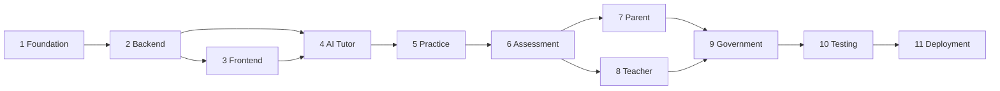

# Delivery Roadmap

## Roadmap conventions

This roadmap sequences the Government Demo from foundation through controlled deployment. Complexity is relative: **Low**, **Medium**, **High**, or **Very High**. A phase may start discovery early, but its implementation completion depends on the phases listed.

## Phase 1 — Project Foundation

**Objective:** Establish the agreed product, architecture, delivery controls, development standards, and initial user journeys before feature implementation.

**Deliverables:**

- Source-of-truth rules and project documentation
- Approved architecture and security baseline
- Prioritized task tracker and project-manager status
- Environment/configuration strategy and repository hygiene plan
- Initial UX flows, bilingual content strategy, data model, API contract, and test strategy

**Completion criteria:** Architecture and initial decisions are reviewed; critical user journeys and acceptance criteria are documented; risks have owners; the first implementation sprint is approved.

**Estimated complexity:** Medium

**Dependencies:** None

## Phase 2 — Backend Development

**Objective:** Build the secure FastAPI foundation and core domain/data capabilities needed by every interface.

**Deliverables:**

- Backend project structure and configuration validation
- Versioned API conventions and standardized error handling
- Authentication, role/scope authorization, and audit foundations
- SQLite schema, migrations, repositories, and synthetic seed data
- Curriculum, profile, progress, upload-metadata, and health capabilities
- Automated backend tests

**Completion criteria:** Core APIs meet agreed contracts; unauthorized cross-user access is rejected; database migrations and test setup are repeatable; backend quality gates pass.

**Estimated complexity:** High

**Dependencies:** Phase 1

## Phase 3 — Frontend Development

**Objective:** Establish the responsive, accessible, bilingual web shell and shared interaction patterns.

**Deliverables:**

- Separate HTML, CSS, and JavaScript foundations
- Government-ready visual system and reusable UI conventions
- Responsive navigation and authenticated shells for all four interfaces
- API client, form validation, loading, empty, and error states
- English/Telugu switching and accessibility baseline

**Completion criteria:** Approved layouts work at defined mobile and desktop breakpoints; keyboard and language paths are reviewed; the frontend consumes backend contracts without embedded secrets.

**Estimated complexity:** High

**Dependencies:** Phases 1–2; approved UX flows may proceed alongside late Phase 2 work

## Phase 4 — AI Tutor

**Objective:** Deliver a governed AI learning experience that teaches concepts through age-appropriate English and Telugu interactions.

**Deliverables:**

- Server-side OpenAI gateway and configuration
- Tutor session and follow-up APIs/UI
- Educational, language, and safety policies
- Text explanation and planned voice/visual explanation pathways
- Structured output validation, timeouts, retries, usage controls, and observability
- AI contract, policy, and failure-mode tests

**Completion criteria:** The tutor teaches before testing, supports follow-ups, primarily responds in Telugu when selected, never exposes credentials, and handles provider or validation failures safely.

**Estimated complexity:** Very High

**Dependencies:** Phases 2–3

## Phase 5 — Practice System

**Objective:** Generate, deliver, and track balanced concept practice aligned to the learner's level.

**Deliverables:**

- Practice generation service and APIs
- Exactly 15 questions per concept: 5 Easy, 5 Medium, and 5 Hard
- Validated question schemas and duplicate/quality checks
- Practice interface, answer capture, session persistence, and resume behavior
- English/Telugu practice paths and automated invariant tests

**Completion criteria:** Every accepted practice set satisfies the exact composition rule; invalid AI output is rejected or safely regenerated; submission state and learner ownership are enforced.

**Estimated complexity:** High

**Dependencies:** Phases 2–4

## Phase 6 — Assessment

**Objective:** Evaluate typed and uploaded answers, explain mistakes, provide corrective guidance, and update progress.

**Deliverables:**

- Answer submission and evaluation workflow
- Validated image/PDF upload pipeline
- Rubric-aware AI evaluation with human-readable feedback
- Mistake classification, corrective teaching, and performance adaptation
- Progress calculation and student dashboard
- Safety, authorization, file-validation, and evaluation tests

**Completion criteria:** Supported answers receive traceable feedback; unsafe files are rejected; final answers are not revealed without teaching; progress updates are accurate and idempotent.

**Estimated complexity:** Very High

**Dependencies:** Phases 2, 4, and 5

## Phase 7 — Parent Portal

**Objective:** Give parents a safe, understandable view of linked children’s learning progress and support needs.

**Deliverables:**

- Parent-to-student linking and authorization
- Child overview, progress trends, strengths, and attention areas
- Recent activity and practical support recommendations
- Responsive bilingual states and privacy-focused tests

**Completion criteria:** Parents can access only linked children; displayed metrics match source records; English/Telugu and mobile paths pass review.

**Estimated complexity:** Medium

**Dependencies:** Phases 2, 3, and 6

## Phase 8 — Teacher Portal

**Objective:** Enable authorized educators to understand class and student performance and target intervention.

**Deliverables:**

- Teacher/class assignment and authorization model
- Class, student, subject, and concept performance views
- Intervention signals and practice oversight
- Filters, accessible tables/charts, bilingual states, and export policy decision
- Data-scope and aggregation tests

**Completion criteria:** Teachers see only assigned scopes; metrics reconcile with assessment data; key intervention workflows are usable and reviewed.

**Estimated complexity:** High

**Dependencies:** Phases 2, 3, and 6

## Phase 9 — Government Dashboard

**Objective:** Present credible, privacy-preserving education indicators across approved organizational scopes.

**Deliverables:**

- Government role and organizational-scope controls
- Aggregated participation, progress, subject, concept, and adoption indicators
- Filters, drill-down limits, accessible visualizations, and data definitions
- Synthetic/demo-data labels and privacy threshold policy
- Aggregation accuracy, performance, and authorization tests

**Completion criteria:** Indicators reconcile with source data; privacy rules prevent inappropriate disclosure; dashboard performance and presentation quality meet demonstration needs.

**Estimated complexity:** High

**Dependencies:** Phases 2, 3, and 6–8

## Phase 10 — Testing

**Objective:** Validate the complete Government Demo against functional, educational, bilingual, security, accessibility, performance, and recovery expectations.

**Deliverables:**

- Consolidated unit, integration, API, and end-to-end suites
- English/Telugu and responsive-browser test matrix
- Accessibility, security, upload, authorization, and AI policy validation
- Performance baselines and demonstration rehearsal
- Defect triage, regression results, and release-readiness report

**Completion criteria:** Critical journeys pass; no open critical/high security defects remain; agreed coverage and performance thresholds pass; stakeholders approve release readiness.

**Estimated complexity:** High

**Dependencies:** Continuous testing in all phases; final validation depends on Phases 2–9

## Phase 11 — Deployment

**Objective:** Prepare and execute a controlled, observable, reversible Government Demo release.

**Deliverables:**

- Approved hosting architecture and environment configuration
- CI/CD quality gates and deployment runbook
- TLS, secret management, backups, monitoring, alerting, and audit configuration
- Synthetic demo dataset and operator guide
- Rollback, incident-response, and post-deployment verification procedures

**Completion criteria:** Explicit deployment approval is recorded; release gates pass; secrets remain server-side; backup/rollback and monitoring are verified; smoke tests pass in the target environment.

**Estimated complexity:** High

**Dependencies:** Phase 10 and explicit human approval

## Milestone dependency flow

Testing, security, accessibility, bilingual validation, documentation, and stakeholder review are continuous responsibilities even though final system validation is grouped in Phase 10.
