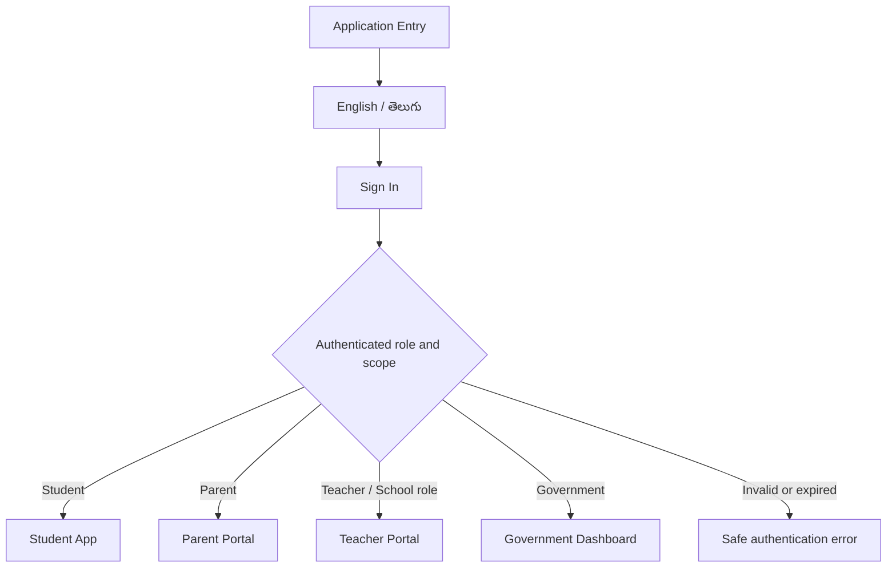
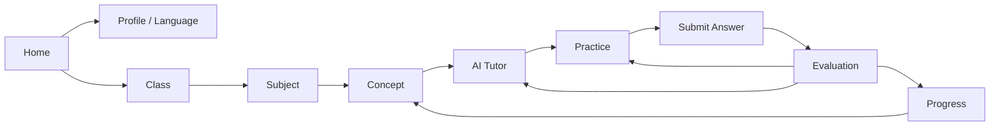
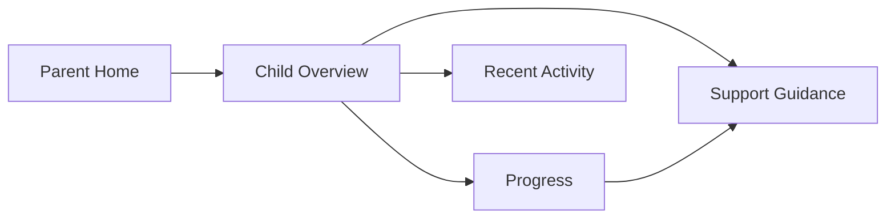
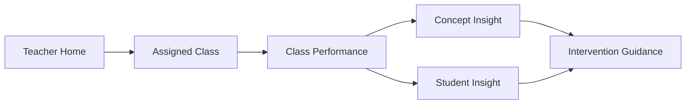
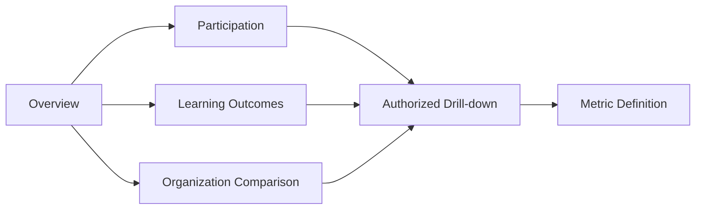

# Screen Flow

## Purpose and architecture reference

This document defines navigation and screen responsibilities for the four separate responsive interfaces in `ARCHITECTURE.md`. It is a flow specification, not a visual design or routing implementation. Components follow `COMPONENT_LIBRARY.md`; behavior follows `USER_JOURNEYS.md` and `FEATURE_SPECIFICATIONS.md`.

## Shared entry and session flow

The backend determines the allowed experience. Language selection never changes permissions. All authenticated shells provide skip navigation, page title, language control, account/session actions, and an accessible global-status region.

## Screen state contract

Every screen defines these states where applicable: initial/loading, populated, empty, filtered-empty, validation error, authorization-safe denial, recoverable service error, unavailable/offline-like state, and success confirmation. Telugu layouts allow text expansion and preserve the same actions and hierarchy.

## Student App

### Screen inventory

| ID | Screen | Primary purpose | Primary transitions |
|---|---|---|---|
| S-01 | Student Home | Resume learning, view current progress, start a concept | S-02, S-03, S-08 |
| S-02 | Profile and Language | Confirm student context and English/తెలుగు | S-01, S-03 |
| S-03 | Class Selection | Choose permitted class context | S-04 |
| S-04 | Subject Selection | Choose a subject | S-03, S-05 |
| S-05 | Concept Selection | Choose a concept and see readiness | S-04, S-06 |
| S-06 | AI Tutor | Receive teaching, ask follow-ups, select explanation mode | S-05, S-07 |
| S-07 | Practice Session | Complete exactly 15 balanced questions | S-06, S-08 |
| S-08 | Answer Submission | Submit typed/image/PDF work and track processing | S-07, S-09 |
| S-09 | Evaluation Feedback | Understand mistake and corrective guidance | S-06, S-07, S-10 |
| S-10 | Progress Dashboard | Review personal concept/subject progress | S-01, S-05 |

**Guardrails:** Practice entry must not bypass teaching context; a student cannot change identifiers to access another learner; unavailable voice/visual mode returns to text without losing tutor context.

## Parent Portal

### Screen inventory

| ID | Screen | Primary purpose | Primary transitions |
|---|---|---|---|
| P-01 | Parent Home | Show linked children and recent high-level context | P-02 |
| P-02 | Child Overview | Establish selected child and time period | P-03, P-04, P-05 |
| P-03 | Progress | Explain subject/concept progress and trends | P-02, P-05 |
| P-04 | Recent Activity | Show approved learning activity summary | P-02 |
| P-05 | Support Guidance | Offer practical, contextual parent actions | P-02, P-03 |

**Guardrails:** Child context remains visibly selected; revoked/unlinked access routes to a safe state rather than another child; raw tutor conversations and unrelated teacher/government data are not exposed.

## Teacher Portal

### Screen inventory

| ID | Screen | Primary purpose | Primary transitions |
|---|---|---|---|
| T-01 | Teacher Home | Summarize assigned classes and priority signals | T-02 |
| T-02 | Assigned Class | Select class/subject and period | T-03, T-04, T-05 |
| T-03 | Class Performance | Compare approved class-level indicators | T-04, T-05 |
| T-04 | Concept Insight | Understand concept misconceptions/performance | T-06 |
| T-05 | Student Insight | View authorized student learning evidence | T-06 |
| T-06 | Intervention Guidance | Review recommended teaching actions | T-02, T-04, T-05 |

**Guardrails:** Navigation lists only assigned scope; filters cannot widen scope; student signals show context/evidence rather than labels; export is absent unless separately approved.

## Government Dashboard

### Screen inventory

| ID | Screen | Primary purpose | Primary transitions |
|---|---|---|---|
| G-01 | Government Overview | Present approved headline indicators and data context | G-02, G-03, G-04 |
| G-02 | Participation | Explore adoption/activity aggregates | G-05 |
| G-03 | Learning Outcomes | Explore subject/concept aggregates | G-05 |
| G-04 | Organization Comparison | Compare permitted scopes without misleading ranking | G-05 |
| G-05 | Authorized Drill-down | Apply organization/period filters with privacy controls | G-06 |
| G-06 | Metric Definition | Explain calculation, source, freshness, and suppression | G-01, G-02, G-03, G-04 |

**Guardrails:** All screens display synthetic/demo context and period; filters remain within server-approved organization scope; privacy-suppressed values cannot be reconstructed through combinations; student-level navigation is absent.

## Navigation and URL behavior

- Use stable, descriptive, experience-specific routes when implementation begins; direct URLs revalidate session, role, and resource scope.
- Preserve safe language and filter context in navigation without putting secrets or sensitive student content in URLs.
- Browser Back returns to the prior meaningful state and does not resubmit actions.
- Unsaved student answers receive proportionate warning; read-only dashboards do not create needless confirmations.
- Unknown, removed, or unauthorized routes use safe not-found/access states consistent with `API_STANDARDS.md`.

## Responsive behavior

On small screens, primary navigation condenses without losing focus control; multi-column dashboards stack by information priority; filters use an accessible disclosure/drawer; tables use scroll or labeled transformations only when comparison remains meaningful. Desktop layouts add density, not new permission or functionality.

## Flow acceptance criteria

- Each screen maps to one experience, one primary purpose, and documented features/components.
- All transitions have authenticated, authorized, loading, empty, and failure behavior where applicable.
- English and Telugu navigation provide equivalent destinations and preserve language.
- Mobile and desktop flows preserve task order and data context.
- No flow creates a path across experience boundaries without explicit authorized role selection.
