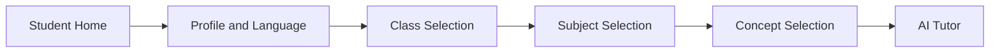
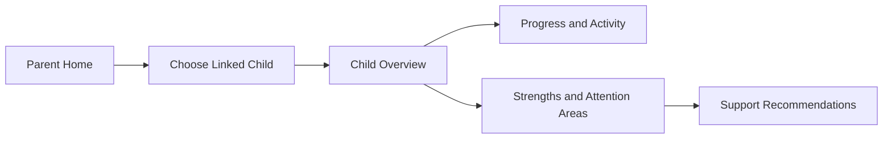
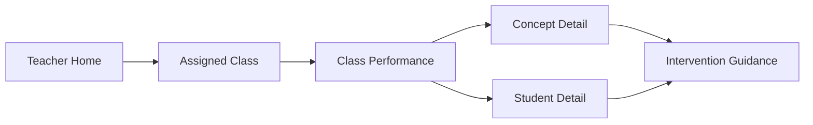
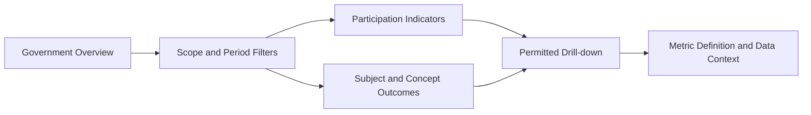

# User Journeys

## Purpose and architecture reference

These Government Demo journeys translate the four client boundaries in `ARCHITECTURE.md` into user outcomes. Screen identifiers refer to `SCREEN_FLOW.md`; features refer to `FEATURE_SPECIFICATIONS.md`; shared behavior follows `UI_GUIDELINES.md` and `COMPONENT_LIBRARY.md`.

## Journey-wide requirements

- Every journey is available in English and Telugu; language choice persists across navigation, validation, loading, empty, success, and error states.
- Telugu-selected journeys use primarily Telugu, with useful English technical/mathematical terms allowed.
- Authentication and authorization are evaluated server-side at every protected transition.
- Keyboard, focus, text scaling, screen-reader labeling, and mobile layouts are part of the journey.
- Synthetic/demo status and data period are visible where relevant.
- Recoverable failures preserve safe context and provide a clear next action.

## Student journeys

### SJ-01 — Start an independent learning session

**Actor:** Authenticated student  
**Goal:** Select learning context and begin a concept explanation without adult assistance.  
**Preconditions:** Active student profile and available synthetic curriculum.

**Main path:** Student confirms profile/language, selects class, subject, and concept, then receives an age-appropriate explanation with simple examples and follow-up options.

**Alternate/error paths:** Missing curriculum produces an informative empty state; invalid/out-of-profile selection is rejected; AI timeout offers a safe retry; unsupported content produces a guided refusal.

**Acceptance criteria:**

- The student completes the flow on mobile and desktop without adult-only controls.
- English and Telugu selections apply to every screen and tutor response.
- The tutor teaches the concept before offering practice.
- Only the authenticated student’s context is used or displayed.

### SJ-02 — Ask follow-up and use explanation modes

**Actor:** Authenticated student  
**Goal:** Clarify a concept through text and approved voice/visual pathways.  
**Preconditions:** Active tutor session and selected concept.

**Main path:** Student asks a follow-up, receives stepwise text, then optionally requests voice or a visual explanation with accessible text alternative.

**Alternate/error paths:** Unsafe/off-topic prompts receive age-appropriate redirection; unavailable modality falls back to text; provider failure does not lose the session.

**Acceptance criteria:** Language, class, concept, and prior safe context persist; output passes educational/language/safety validation; media has accessible fallback; no OpenAI credential or provider payload reaches the browser.

### SJ-03 — Complete concept practice

**Actor:** Authenticated student  
**Goal:** Practise a taught concept at balanced difficulty.  
**Preconditions:** Concept teaching has occurred.

**Main path:** Student starts a generated set, answers questions, navigates/resumes safely, and submits.

**Acceptance criteria:** Every accepted set contains exactly 15 questions—5 Easy, 5 Medium, and 5 Hard; progress is clear without revealing answers prematurely; only the owner can access/submit; English/Telugu questions and controls remain consistent.

### SJ-04 — Submit work and learn from evaluation

**Actor:** Authenticated student  
**Goal:** Submit typed, image, or PDF work and understand mistakes.  
**Preconditions:** Active eligible question/practice session.

**Main path:** Student submits typed work or a validated upload, waits through an honest processing state, then receives mistake identification, corrective steps, and an updated progress view.

**Alternate/error paths:** Unsafe/oversized/unsupported files are rejected before AI processing; duplicate submission is handled idempotently; unreadable work requests correction rather than inventing evaluation.

**Acceptance criteria:** Feedback does not only reveal the final answer; upload rules and ownership hold; progress updates once; Telugu-selected feedback is primarily Telugu; failure states preserve safe work where possible.

## Parent journeys

### PJ-01 — Review a linked child

**Actor:** Authenticated parent  
**Goal:** Understand a linked child’s recent learning and how to help.  
**Preconditions:** Active parent–student link.

**Alternate/error paths:** No linked child shows a non-disclosing support state; revoked links immediately deny access; missing activity is explained without negative judgment.

**Acceptance criteria:** Only linked children appear; metrics reconcile with approved progress data; the selected child/time period is clear; recommendations are plain-language, contextual, and available in English/Telugu.

## Teacher journeys

### TJ-01 — Identify a class intervention

**Actor:** Authenticated assigned teacher  
**Goal:** Find concepts or learners needing teaching support.  
**Preconditions:** Active class/subject assignment.

**Acceptance criteria:** Only assigned scope appears; filters retain context; aggregates reconcile with source records; signals include evidence and do not reduce ability to one score; tables/charts and guidance work in English/Telugu and have accessible alternatives.

## Government journeys

### GJ-01 — Review education indicators

**Actor:** Authenticated government official  
**Goal:** Understand participation and learning trends within an approved organization scope.  
**Preconditions:** Active government role and scope.

**Alternate/error paths:** Small cohorts are suppressed; unauthorized drill-down is denied without confirming protected data; stale/partial data is labeled; empty filters do not fabricate values.

**Acceptance criteria:** All data remains inside approved scope; metrics show definition, period, freshness, and synthetic-demo label; privacy thresholds hold under combined filters; charts have text/table alternatives; English/Telugu convey equivalent meaning.

## Cross-journey handoffs

The four experiences do not directly impersonate or enter each other. Student activity may contribute to governed progress; linked parents see approved summaries; assigned teachers see authorized evidence; government users see privacy-preserving aggregates. Every handoff is a backend policy and data transformation, not a frontend link to another role’s screen.

## Journey review gate

A journey is implementation-ready when screens and features are traceable, copy/content responsibilities are assigned, English/Telugu and accessibility states are defined, role/scope rules are testable, failure/recovery paths are specified, and unresolved product/security decisions are recorded rather than assumed.
